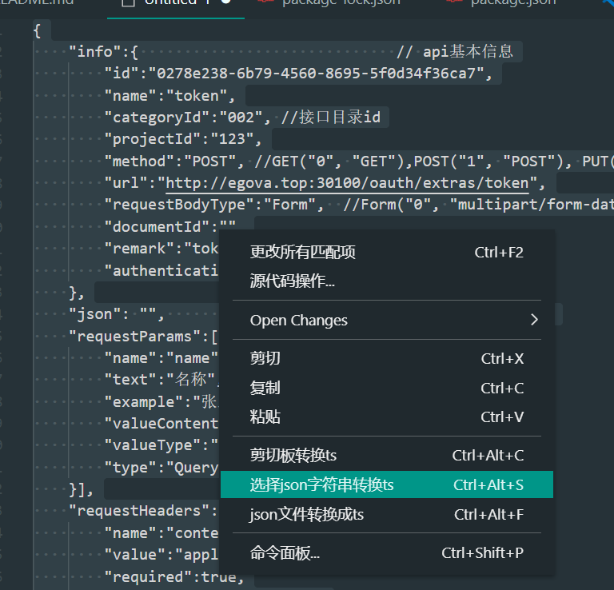
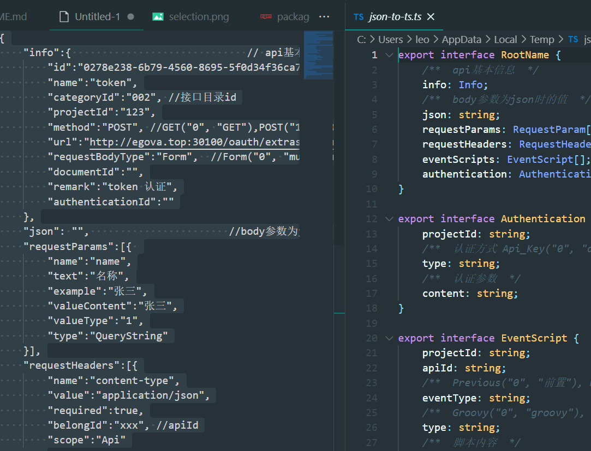

# vscode-plugin-json2interface

## **json转换成typescript的interface**

仓库地址[https://github.com/sjhleo/vscode-plugin-json2interface](https://github.com/sjhleo/vscode-plugin-json2interface)
### 支持:
1. 剪切板json字符串
2. 选中json
3. json文件

### 示例
在vscode中选中json

右键命令菜单或者使用快键键,可以在右侧临时文件中查看转换结果

### 配置项

| option                  | type                     | default                              | desc                                                                                                                 |
| ----------------------- | ------------------------ | ------------------------------------ | -------------------------------------------------------------------------------------------------------------------- |
| prefix                  | string                   | ""                                   | 生成接口的默认前缀                                                                                                      |
| name                    | string                   | RootName                             | 生成接口的默认名字                                                                 |
| addExport               | boolean                  | true                                 | 是否添加export                                                       |
| humps                   | boolean                  | false                                | 是否将key使用humps进行驼峰处理,a_b => aB,设置后 disallowComments配置失效,转换的结果都不会带有注释 |
| disallowComments        | boolean                  | true                                 | 是否禁用注释                                                                       |
| singleLineJsDocComments | boolean                  | true                                 | 单行注释
